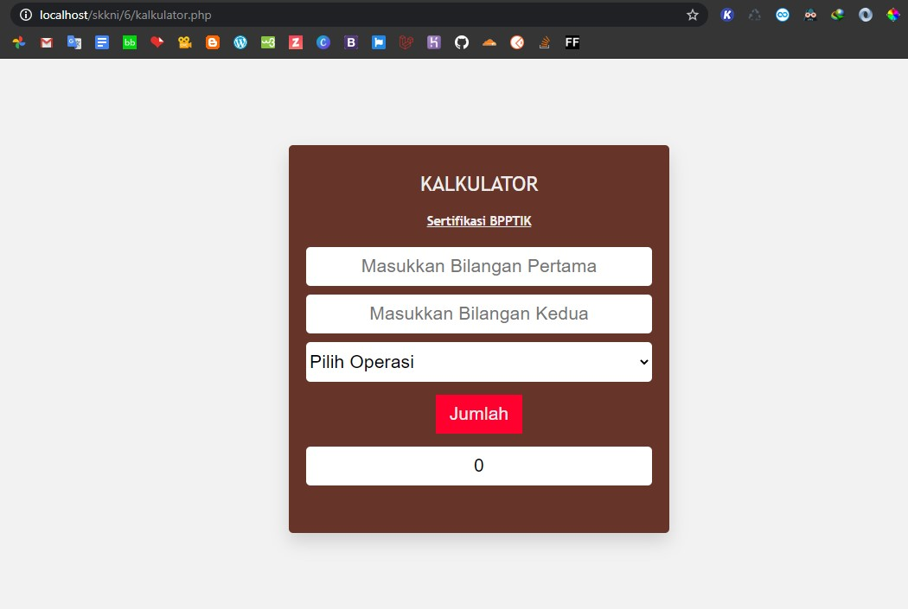

Pelatihan BPPTIK Kominfo Berbasis SKKNI
=======================================

 
 
Laravel 4 Library for calling http://freegeoip.net/ API.

  
    
    <h3 align="center">Pelatihan Junior Web Developer</h3>

## Membuat Program Kalkulator Sederhana

Program ini bertujuan untuk melakukan proses perhitungan sederhana.
Berikut beberapa requirements yang saya gunakan :

Requirements
============

* [PHP >= 7.0](https://packagecontrol.io/installation)
* CSS
* [XAMPP](https://www.apachefriends.org/index.html)
* [Sublime Text 3](https://www.sublimetext.com/3)

Usages
============

1. Install local server dan text editor
2. Buka local server dan jalankan server
3. Buat struktur folder dan file.php didalam folder tersebut
4. Tuliskan Code Program
5. Buat file style.css untuk mempercantik tampilan
6. Buka localhost/folder/file.php untuk melihat output program

## OUTPUT

  
    
    </a>
    <i>Output Program</i>

Credits
============

* [Edward Evbert A.](https://edwevb.github.io)
* [BPPTIK](https://bpptik.kominfo.go.id)

